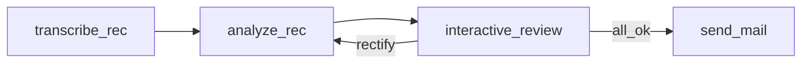

# Microflow

Microflow is a barebones (~3kb) LLM agent building framework that works in browser and Node.js runtime. Microflow is heavily inspired by [PocketFlow](https://github.com/The-Pocket/PocketFlow) when it comes to abstractions. However it's simpler (because of JavaScript's generator functions) and lighter. *You don't have to know PocketFlow to read this docs*

## What Microflow is and what it is not?
- **It's provides you a mental model (abstractions)** based on which you can build agents. These abstraction help you build agents that are easy to reason about, reliable, debuggable and easy to maintain.
- **It's not** a library that abstracts your LLM calls and manage their lifecycle (context / caching / skills / mcp / tools etc). *We believe - abstraction over LLM calls makes things complicated as your agent becomes more complex*. You have to write your own utils that makes call to (openai, anthropic, gemini, mistral, openrouter, or any other openweight / opensource LLMs), hence you have full control over the llm clients.

## How is Microflow different from PocketFlow?
*Only relevant for those who are familiar with PocketFlow, else ignore*
- All nodes are async default
- There is no difference between batch and single node. In microflow, if the `prep` function yields multiple value it becomes a batch node automatically 

### Key Differentiators from PocketFlow

| Feature          | PocketFlow                        | MicroFlow                                    |
| ---------------- | --------------------------------- | -------------------------------------------- |
| Language         | Python                            | TypeScript                                   |
| Node Pipeline    | prep-exec-post ✅                  | prep-exec-post ✅                             |
| Flow Control     | Action strings ✅                  | Action strings ✅                             |
| Node Types       | Node, BatchNode, AsyncNode        | Single Node with generators                  |
| prep/exec        | Functions                         | **Async Generators** (always)                |
| post             | Function                          | **Async Function** (returns Promise)         |
| Batch Processing | Separate BatchNode class          | Built-in via generators                      |
| Streaming        | Via AsyncNode                     | Built-in via generators                      |
| Node Connection  | `n1 >> n2`, `n1 - "action" >> n2` | `n1.connect(n2)`, `n1.connect('action', n2)` |
| Runtime Support  | Node.js/Python                    | Browser + Node.js                            |

## Abstractions

Microflow help you build agents (that might or might not use LLMs) by constructing a directed graph of execution

For example, let's say you want to create an agent that does the following -

Let's say, you wanna build a product for which you had done user interviews over video conferencing tool; you have the recording of the meeting and now you want to analyze the interviews interactively -> create actionable and share it with your cofounder and investors.

This what the execution graph looks like

- `transcribe_rec`: Download the recordings from blob storage (let's say s3) and transcribe the audio via OpenAI api
- `analyze_rec`: Run analysis on the transcribed text based on a prompt
- `interactive_review`: The agent seeks user's approval in an interactive session with user; If user deems the analysis ok it follows the `all_ok` edge and execute the node. If user wants LLM to analyze the transcription differently then the execution follows `rectify` edge on the graph above and re-analyze (execute `analyze_rec`) with new requirement
- `send_mail`: Send mail with the analysis

The agent's workflow is divided into small block of execution represented by `Node` in the graph. Breaking down the agent's workflow to these nodes makes the agent
- **easy to reason about**
- **easy to debug**: you can easily see how the agent state is getting mutated / input output data
- **easy to extend**: you can easily change the agent behaviour without breaking execution flow (no complex conditionals, state dependency, waiting)
- **more stable**: Each step's failure can be handled gracefully locally or globally

### `Node`
