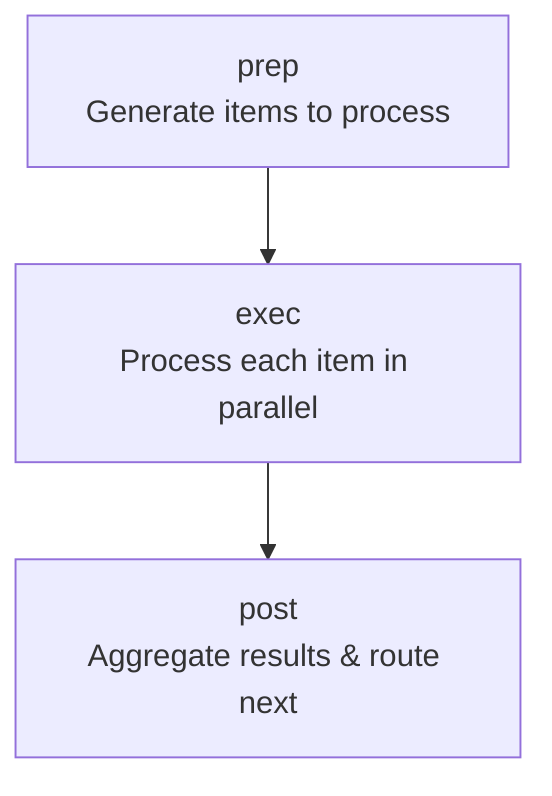

# PinFlow

A barebones (~3kb) TypeScript framework for building LLM agents and workflows. Works in both browser and Node.js.

**Key Features:**
- 🎯 **Single abstraction**: One `Node` class handles everything
- ⚡ **Parallel execution**: Built-in concurrent processing via generators
- 🔄 **Automatic retries**: Configurable retry logic with fallback handlers
- 🌊 **Streaming support**: Process items as they're generated
- 🌐 **Universal runtime**: Browser + Node.js compatible
- 📦 **Tiny footprint**: ~3kb with zero dependencies

Heavily inspired by [PocketFlow](https://github.com/The-Pocket/PocketFlow), but simpler and lighter thanks to JavaScript's async generators.

---

## Quick Start

Here's a minimal example to get you started:

```typescript
import { Node, run } from 'pinflow';

// Define your shared state
// The same is passed to `prep` -> `exec` -> `post` methods, so you can share state between stages
interface Store {
  urls: string[];
  results?: string[];
}

// Create a node to fetch URLs
class FetchUrls extends Node<Store, string, string> {
  async *prep(store: Store) {
    // Yield each URL - exec runs in parallel for all
    for (const url of store.urls) {
      yield url;
    }
  }

  async exec(store: Store, url: string) {
    const response = await fetch(url);
    return response.text();
  }

  async post(store: Store, urls: string[], results: string[]) {
    store.results = results;
    console.log(`Fetched ${results.length} pages`);
  }
}

// Run the workflow
const store: Store = {
  urls: ['https://example.com', 'https://example.org']
};

await run(new FetchUrls(), store);
```

That's it! You've just built a concurrent URL fetcher with automatic retries.

---

## Core Concepts

### The Node

PinFlow has **one abstraction**: the `Node`. Each node represents a logical unit of work in your workflow and follows a three-phase pipeline:



1. **prep()**: An async generator that yields items to process
2. **exec()**: Processes each item (runs in parallel for all items)
3. **post()**: Aggregates results and determines what happens next

### The Store

The `Store` is a shared state object that flows through your entire workflow. Every node in your graph receives the same store, allowing you to:
- Pass data between nodes
- Accumulate results
- Share configuration

```typescript
interface MyStore {
  config: { apiKey: string };
  rawData?: string[];
  processedData?: ProcessedItem[];
}
```

### Example 1: Single Item Processing

When `prep()` yields **one value**, `exec()` is called **once**:

```typescript
class FetchUser extends Node<Store, string, User> {
  async *prep(store: Store) {
    yield store.userId; // Single yield = single item
  }

  async exec(store: Store, userId: string) {
    return await api.getUser(userId);
  }

  async post(store: Store, userIds: string[], users: User[]) {
    store.user = users[0];
  }
}
```

### Example 2: Batch Processing

When `prep()` yields **multiple values**, each `exec()` call **starts immediately** for each yielded item (runs in parallel, doesn't wait for all yields):

```typescript
class FetchUsers extends Node<Store, string, User> {
  async *prep(store: Store) {
    // Yields 100 user IDs
    for (const userId of store.userIds) {
      yield userId; // Each yield triggers an exec() call
    }
  }

  async exec(store: Store, userId: string) {
    // Called 100 times in parallel!
    return await api.getUser(userId);
  }

  async post(store: Store, userIds: string[], users: User[]) {
    // Receives all 100 results at once
    store.users = users;
  }
}
```

**Key insight**: There's no separate "BatchNode" class. Just yield more items!

### Example 3: Yielding Promises

You can yield promises directly to start async work early:

```typescript
async *prep(store: Store) {
  for (const url of store.urls) {
    // Start fetching immediately, exec awaits the result
    yield fetch(url).then(r => r.json());
  }
}
```

---

## Building Workflows

### Connecting Nodes: Default Edges

Use `.connect()` to chain nodes together:

```typescript
const fetch = new FetchData();
const process = new ProcessData();
const save = new SaveData();

// Linear flow: fetch → process → save
fetch.connect(process);
process.connect(save);

await run(fetch, store);
```

When `post()` returns `undefined` or `null`, the workflow follows the default edge.

### Conditional Flows: Named Actions

Return **action strings** from `post()` to create branching logic:

```typescript
class ValidateData extends Node<Store, Data, ValidationResult> {
  async *prep(store: Store) {
    yield store.data;
  }

  async exec(store: Store, data: Data) {
    return validate(data);
  }

  async post(store: Store, items: Data[], results: ValidationResult[]) {
    const isValid = results.every(r => r.valid);

    // Return different actions based on validation
    return isValid ? 'success' : 'retry';
  }
}

const validate = new ValidateData();
const success = new SuccessNode();
const retry = new RetryNode();

// Connect named actions
validate
  .connect('success', success)  // When post() returns 'success'
  .connect('retry', retry);     // When post() returns 'retry'

await run(validate, store);
```

### Stopping Execution: KILL

Use the `KILL` symbol to terminate the workflow immediately:

```typescript
import { Node, KILL, run } from 'pinflow';

async post(store: Store, items: any[], results: any[]) {
  if (store.shouldStop) {
    return KILL; // Workflow stops here
  }
  // Otherwise continue to default edge
}
```

### Flow Control Summary

```typescript
async post(store: Store, items: any[], results: any[]) {
  // Option 1: Follow default edge
  return undefined; // or return null, or no return statement

  // Option 2: Follow named edge
  return 'action-name';

  // Option 3: Stop workflow
  return KILL;

  // If no matching edge exists, workflow stops
}
```

---

## Error Handling & Resilience

### Automatic Retries

Every `exec()` call is automatically retried on failure:

```typescript
class FlakyAPI extends Node {
  async exec(store: Store, item: string) {
    // If this throws, it's retried up to 3 times (default)
    return await unreliableAPI.call(item);
  }
}
```

**Default retry policy:**
- `maxRetries`: 3 attempts
- `retryDelay`: 2000ms between attempts
- `timeout`: 60000ms per attempt

### Customizing Retry Policy

Pass a config object to the constructor:

```typescript
class CustomRetry extends Node {
  constructor() {
    super({
      maxRetries: 5,        // Try 5 times
      retryDelay: 1000,     // Wait 1s between retries
      timeout: 30000        // 30s timeout per attempt
    });
  }

  // ... prep/exec/post
}
```

### Fallback Handling

Implement `execFallback()` for graceful degradation when all retries fail:

```typescript
class FetchWithCache extends Node<Store, string, User> {
  async exec(store: Store, userId: string) {
    // Might fail after all retries
    return await api.getUser(userId);
  }

  async execFallback(store: Store, userId: string, error: Error) {
    // Called after all retries exhausted
    console.warn(`API failed for ${userId}, using cache`);
    return store.cache.get(userId) ?? { id: userId, name: 'Unknown' };
  }

  // ... prep/post
}
```

**Without `execFallback()`**: The error is thrown and terminates the workflow.
**With `execFallback()`**: Your fallback result is used instead.

### Custom Error Logging

Override `onError()` to customize retry logging:

```typescript
class CustomLogging extends Node {
  onError(error: Error, attempt: number, maxRetries: number) {
    // Custom logging logic
    logger.error({
      node: this.constructor.name,
      attempt,
      maxRetries,
      error: error.message
    });
  }

  // ... prep/exec/post
}
```

---

## Complete Example: User Interview Analyzer

Let's build an agent that transcribes Zoom recordings, analyzes them with an LLM, and emails the results.

### Workflow Graph


### Implementation

```typescript
import { Node, run, KILL } from 'pinflow';
import OpenAI from 'openai';

interface Store {
  s3Bucket: string;
  s3Path: string;
  transcriptionPath?: string;
  analysis?: string;
  approved?: boolean;
  feedback?: string;
}

// Node 1: Download and transcribe recordings
class TranscribeRecordings extends Node<Store, string, string> {
  async *prep(store: Store) {
    const files = await listS3Files(store.s3Bucket, store.s3Path);

    for (const s3Path of files) {
      const filename = basename(s3Path);
      // Yield promise to start download early
      yield downloadFromS3(s3Path, `/tmp/${filename}`)
        .then(() => `/tmp/${filename}`);
    }
  }

  async exec(store: Store, localPath: string) {
    const openai = new OpenAI();
    const transcription = await openai.audio.transcriptions.create({
      file: fs.createReadStream(localPath),
      model: 'whisper-1'
    });
    return transcription.text;
  }

  async post(store: Store, paths: string[], transcriptions: string[]) {
    const combined = transcriptions.join('\n\n---\n\n');
    const outputPath = `/tmp/transcription-${Date.now()}.txt`;
    await fs.promises.writeFile(outputPath, combined);
    store.transcriptionPath = outputPath;
  }
}

// Node 2: Analyze transcriptions with LLM
class AnalyzeTranscription extends Node<Store, string, string> {
  async *prep(store: Store) {
    const content = await fs.promises.readFile(
      store.transcriptionPath!,
      'utf-8'
    );
    yield content;
  }

  async exec(store: Store, transcription: string) {
    const openai = new OpenAI();

    const prompt = store.feedback
      ? `Previous analysis needs revision. Feedback: ${store.feedback}\n\nTranscript: ${transcription}`
      : `Analyze this user interview transcript: ${transcription}`;

    const response = await openai.chat.completions.create({
      model: 'gpt-4',
      messages: [{ role: 'user', content: prompt }]
    });

    return response.choices[0].message.content!;
  }

  async post(store: Store, transcripts: string[], analyses: string[]) {
    store.analysis = analyses[0];
    store.feedback = undefined; // Clear previous feedback
  }
}

// Node 3: Interactive review
class InteractiveReview extends Node<Store, string, boolean> {
  async *prep(store: Store) {
    console.log('\n=== Analysis ===');
    console.log(store.analysis);
    yield store.analysis!;
  }

  async exec(store: Store, analysis: string) {
    const answer = await prompt('Approve this analysis? (y/n): ');
    return answer.toLowerCase() === 'y';
  }

  async post(store: Store, analyses: string[], approved: boolean[]) {
    if (approved[0]) {
      store.approved = true;
      return 'approved';
    } else {
      store.feedback = await prompt('What needs to change? ');
      return 'revise';
    }
  }
}

// Node 4: Send email
class SendEmail extends Node<Store, string, void> {
  async *prep(store: Store) {
    yield store.analysis!;
  }

  async exec(store: Store, analysis: string) {
    await sendEmail({
      to: 'team@company.com',
      subject: 'User Interview Analysis',
      body: analysis
    });
  }

  async post(store: Store, analyses: string[], results: void[]) {
    console.log('Email sent successfully!');
  }
}

// Build the workflow
const transcribe = new TranscribeRecordings();
const analyze = new AnalyzeTranscription();
const review = new InteractiveReview();
const email = new SendEmail();

transcribe.connect(analyze);
analyze.connect(review);
review
  .connect('approved', email)
  .connect('revise', analyze);  // Loop back for revision

// Run it
const store: Store = {
  s3Bucket: 'my-recordings',
  s3Path: 'interviews/2024/'
};

await run(transcribe, store);
```

---

## Configuration

### NodeConfig Options

```typescript
interface NodeConfig {
  maxRetries?: number;   // Number of retry attempts (default: 3)
  retryDelay?: number;   // Milliseconds between retries (default: 2000)
  timeout?: number;      // Milliseconds per attempt (default: 60000)
}
```

### Setting Custom Config

```typescript
class MyNode extends Node {
  constructor() {
    super({
      maxRetries: 5,
      retryDelay: 1000,
      timeout: 30000
    });
  }
}
```

### Using setParams

Attach arbitrary parameters to node instances:

```typescript
const node = new GenericFetchNode()
  .setParams({ endpoint: '/users', pageSize: 50 });

// Access in prep/exec/post via this.params
async exec(store: Store, item: string) {
  const { endpoint, pageSize } = this.params;
  // ...
}
```

---

## API Reference

### Node Class

```typescript
abstract class Node<TStore, TPrepItem, TExecResult>
```

**Type Parameters:**
- `TStore`: Type of the shared state object
- `TPrepItem`: Type yielded by `prep()` and consumed by `exec()`
- `TExecResult`: Type returned by `exec()`

**Abstract Methods:**

```typescript
// Generate items to process
abstract prep(store: TStore): AsyncGenerator<TPrepItem | Promise<TPrepItem>>

// Process a single item (called in parallel for each prep item)
abstract exec(store: TStore, item: TPrepItem): Promise<TExecResult>

// Aggregate results and determine next action
abstract post(
  store: TStore,
  prepItems: TPrepItem[],
  execResults: TExecResult[]
): Promise<Action | void>
```

**Optional Methods:**

```typescript
// Fallback when exec fails after all retries
execFallback?(store: TStore, item: TPrepItem, error: Error): Promise<TExecResult>

// Custom error logging during retries
onError(error: Error, attempt: number, maxRetries: number): void
```

**Methods:**

```typescript
// Connect to next node
connect(action: Action | Node, target?: Node): this

// Attach parameters
setParams(params: Params): this
```

### run Function

```typescript
async function run<TStore>(node: Node<TStore>, store: TStore): Promise<void>
```

Executes the workflow starting from the given node.

### Types

```typescript
type Action = string | typeof KILL | undefined | null;
type Params = Record<string, any>;
type Store<T = Record<string, any>> = T;

const KILL: unique symbol; // Stop workflow execution
```

---

## Philosophy

### What PinFlow Is

**PinFlow provides a mental model** (abstractions) for building agents that are:
- **Easy to reason about**: Each node is a clear unit of work
- **Easy to debug**: Inspect inputs/outputs at each step
- **Easy to extend**: Add nodes without breaking existing flow
- **Reliable**: Built-in retry logic and error handling

### What PinFlow Is Not

**PinFlow does NOT abstract your LLM calls**. We believe abstraction over LLM calls becomes problematic as agents grow complex. You maintain full control over:
- LLM client initialization (OpenAI, Anthropic, Gemini, etc.)
- Prompt engineering
- Context management
- Caching strategies
- Tool/function calling

This is **intentional**. PinFlow handles workflow orchestration. You handle LLM interactions.

---

## How is PinFlow Different from PocketFlow?

*Only relevant if you're familiar with PocketFlow*

PinFlow brings PocketFlow's elegant design to TypeScript with some key simplifications:

| Feature          | PocketFlow                        | PinFlow                                      |
| ---------------- | --------------------------------- | -------------------------------------------- |
| Language         | Python                            | TypeScript                                   |
| Node Pipeline    | prep-exec-post ✅                  | prep-exec-post ✅                             |
| Flow Control     | Action strings ✅                  | Action strings ✅                             |
| Node Types       | Node, BatchNode, AsyncNode        | **Single Node class**                        |
| prep/exec        | Functions                         | **Async Generators** (always)                |
| post             | Function                          | **Async Function** (returns Promise)         |
| Batch Processing | Separate BatchNode class          | Built-in via generators                      |
| Streaming        | Via AsyncNode                     | Built-in via generators                      |
| Node Connection  | `n1 >> n2`, `n1 - "action" >> n2` | `n1.connect(n2)`, `n1.connect('action', n2)` |
| Runtime Support  | Node.js/Python                    | **Browser + Node.js**                        |

**Key differences:**
- All nodes are async by default
- No separate batch/async node classes - just yield multiple values
- Works in the browser out of the box

---

## License

MIT
