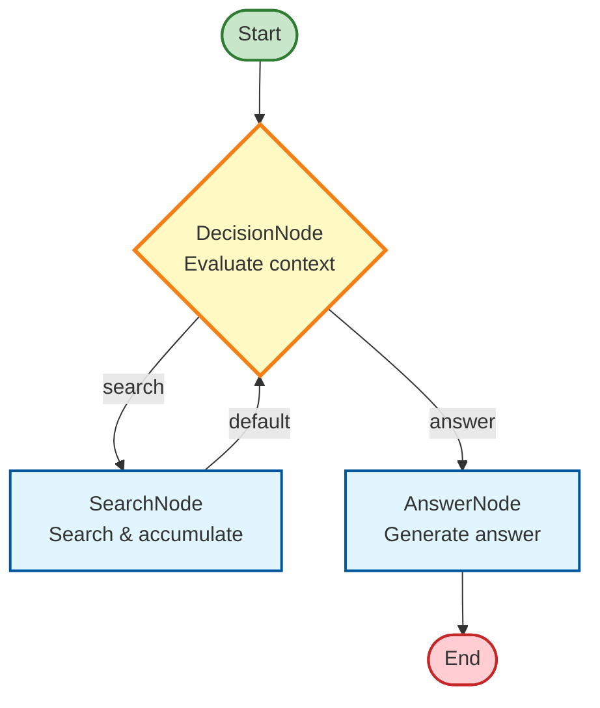

# Agent Pattern: Dynamic Decision-Making with Loops

# Agent Pattern: Dynamic Decision-Making with Loops

## Overview

This example demonstrates the agent pattern, where nodes make dynamic decisions based on context
rather than following a predetermined path. The agent iteratively searches for information and
decides when it has enough context to answer a question.

## What This Example Does

The example creates a question-answering agent with three nodes:
1. **DecisionNode**: Evaluates current state and decides whether to search for more info or answer
2. **SearchNode**: Performs a search and adds results to context
3. **AnswerNode**: Generates the final answer using accumulated context

The agent loops between DecisionNode and SearchNode until it has sufficient context, then transitions to AnswerNode.

## How It Works

### Dynamic Flow Control

Unlike workflows with predetermined paths, agents use decision-making:
- DecisionNode outputs an action ('search' or 'answer') based on current state
- SearchNode loops back to DecisionNode for iterative refinement
- The agent continues until reaching a terminal state (answer ready)

## Execution Flow



## Key Concepts

- **Dynamic Actions**: DecisionNode returns different actions based on runtime state
- **Loops**: SearchNode connects back to DecisionNode, creating an iterative cycle
- **Context Management**: Agent accumulates information across iterations
- **Terminal Conditions**: Agent exits loop when reaching terminal action ('answer')

## Best Practices for High-Performance Agents

### Context Management
- Provide relevant, minimal context
- Use RAG to retrieve only pertinent information
- Avoid "lost in the middle" problems by limiting context size

### Action Space Design
- Offer a well-structured, unambiguous set of actions
- Avoid overlapping options that confuse the decision process
- Keep actions clear and distinct

## When to Use This Pattern

Use agents when:
- Tasks require dynamic decision-making based on context
- You need multi-step reasoning with adaptive behavior
- The execution path cannot be predetermined
- You want iterative refinement (search → evaluate → search → answer)


## Example

```typescript
const store: AgentStore = {
  question: 'What is the latest news about AI?',
  context: [],
  iterations: 0
};

const decisionNode = new DecisionNode();
const searchNode = new SearchNode();
const answerNode = new AnswerNode();

decisionNode
  .connect('search', searchNode)
  .connect('answer', answerNode);

searchNode.connect(decisionNode);

await run(decisionNode, store);

console.log(`Iterations: ${store.iterations}`);
console.log(`Answer: ${store.answer}`);
 
```