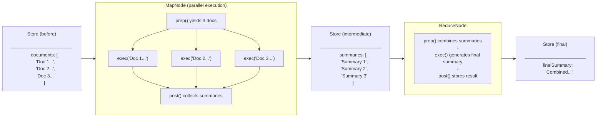

# Tutorial: Summarizing Multiple Documents with Parallel Processing

> **[View example code](../../tests/map-reduce.test.ts)**

## What Will Be Built

A document summarization pipeline that processes multiple documents in parallel and
combines their summaries into a single cohesive overview. Three documents will be
summarized concurrently, then their individual summaries will be merged into one
final summary.

Input:  { documents: ['Doc 1...', 'Doc 2...', 'Doc 3...'] }
Output: { summaries: ['Summary 1', 'Summary 2', 'Summary 3'], finalSummary: '...' }

## Workflow Diagram



## Implementation

The workflow is divided into two phases:

**Map Phase (MapNode)**: Each document from the store will be yielded individually
by `prep()`. All documents will be processed concurrently by separate `exec()` calls.
The individual summaries will be collected and stored in the shared state by `post()`,
which then transitions to the ReduceNode via the default edge.

**Reduce Phase (ReduceNode)**: All individual summaries will be combined into a single
prompt by `prep()`. The combined summary will be generated by `exec()`. The final result
will be stored by `post()`.


## Example

```typescript
const store: MapReduceStore = {
  documents: [
    'Document 1: Introduction to AI...',
    'Document 2: Machine Learning basics...',
    'Document 3: Deep Learning advances...'
  ]
};

const mapNode = new MapNode();
const reduceNode = new ReduceNode();

// Connect map phase to reduce phase
mapNode.connect(reduceNode);

// Run the pipeline - documents will be processed in parallel
await run(mapNode, store);

// Access the results
console.log(store.summaries);    // ['Summary 1', 'Summary 2', 'Summary 3']
console.log(store.finalSummary); // 'Combined summary of all documents'
 
```