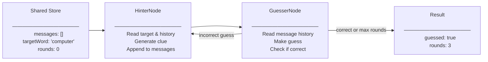

# Tutorial: Building a Word-Guessing Game with Coordinating Agents

> **[View example code](../../tests/multi-agent.test.ts)**

## What Will Be Built

A collaborative word-guessing game where two agents work together through iterative
communication. A Hinter agent provides clues about a target word, and a Guesser agent
attempts to identify it. The agents exchange messages through a shared queue until
the word is guessed or a maximum number of rounds is reached.

Input:  { targetWord: 'computer', messages: [], rounds: 0 }
Output: { guessed: true, messages: [hinter clues & guesses], rounds: 3 }

## Workflow Diagram



## Implementation

The workflow consists of two nodes that alternate execution:

**HinterNode**: The target word and recent message history will be read from the
store. A clue will be generated and appended to the shared message queue. The
default edge will transition control to the GuesserNode.

**GuesserNode**: The complete message history will be read from the store. A guess
will be made and added to the message queue. If the guess matches the target word
or the maximum rounds are reached, the workflow will terminate by returning KILL.
Otherwise, the default edge will return control to the HinterNode.

**Communication**: Both agents communicate through a message array in the shared
store. Each message contains the sender's name and content, allowing agents to
understand the conversation context.


## Example

```typescript
const store: MultiAgentStore = {
  messages: [],
  targetWord: 'computer',
  guessed: false,
  rounds: 0
};

const hinterNode = new HinterNode();
const guesserNode = new GuesserNode();

// Nodes are connected to form a coordination loop
hinterNode.connect(guesserNode);
guesserNode.connect(hinterNode);

// The workflow will alternate between agents until completion
await run(hinterNode, store);

// Final state after coordination
console.log(store.guessed); // true
console.log(store.rounds);  // 3
 
```