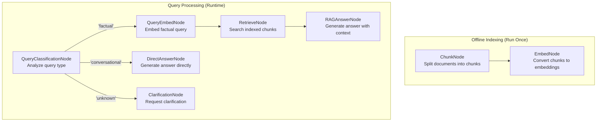

# Building an Intelligent RAG System with Query Classification

> **[View example code](../../tests/rag.test.ts)**

## What Will Be Built

A Retrieval-Augmented Generation (RAG) system that intelligently routes queries
based on their type. Documents will be indexed offline, and incoming queries will
be classified to determine the optimal answering strategy:
- **Factual queries** → Full RAG pipeline with document retrieval
- **Conversational queries** → Direct LLM response (no retrieval)
- **Unknown queries** → Clarification request

This demonstrates conditional routing using named edges to optimize performance
by avoiding unnecessary retrieval operations.

Input:  "What is the capital of France?" → RAG with retrieval
Input:  "Hello, how are you?" → Direct answer
Input:  "xyzabc nonsense" → Clarification

## Workflow Diagram



## Implementation

The system is divided into two stages:

**Stage 1: Offline Indexing**

Documents will be preprocessed and stored for fast retrieval:
- **ChunkNode** breaks raw documents into manageable pieces (sentences/paragraphs)
- **EmbedNode** converts each chunk into vector embeddings using an embedding model

These nodes are chained sequentially, with each stage storing results in the shared store.

**Stage 2: Query Processing with Classification**

Incoming queries will be analyzed by **QueryClassificationNode**, which determines
the query type and returns it as an action. This action routes to different paths
using named edges:

- **'factual' edge**: Queries requiring document context are routed through the full
  RAG pipeline (QueryEmbedNode → RetrieveNode → RAGAnswerNode)
- **'conversational' edge**: Simple greetings or conversational queries skip retrieval
  and are handled by DirectAnswerNode
- **'unknown' edge**: Unclassifiable queries are routed to ClarificationNode, which
  requests rephrasing

Named edges enable conditional routing based on the classification result, avoiding
expensive retrieval operations when they're not needed.


## Example

```typescript
// Stage 1: Index documents offline
const indexStore: RAGStore = {
  documents: [
    'Paris is the capital of France. It has the Eiffel Tower.',
    'London is the capital of England. It has Big Ben.'
  ]
};

const chunkNode = new ChunkNode();
const embedNode = new EmbedNode();
chunkNode.connect(embedNode);
await run(chunkNode, indexStore);

// Stage 2: Query with classification
const queryStore: RAGStore = {
  chunks: indexStore.chunks,
  embeddings: indexStore.embeddings,
  query: 'What is the capital of France?'
};

const classifyNode = new QueryClassificationNode();
const queryEmbedNode = new QueryEmbedNode();
const retrieveNode = new RetrieveNode();
const answerNode = new RAGAnswerNode();
const directAnswerNode = new DirectAnswerNode();
const clarificationNode = new ClarificationNode();

// Setup conditional routing with named edges
classifyNode.connect('factual', queryEmbedNode);
queryEmbedNode.connect(retrieveNode);
retrieveNode.connect(answerNode);

classifyNode.connect('conversational', directAnswerNode);
classifyNode.connect('unknown', clarificationNode);

await run(classifyNode, queryStore);

// The query was classified as 'factual', so the full RAG pipeline was executed
console.log(queryStore.queryType); // 'factual'
console.log(queryStore.answer); // Answer generated with retrieved context
 
```