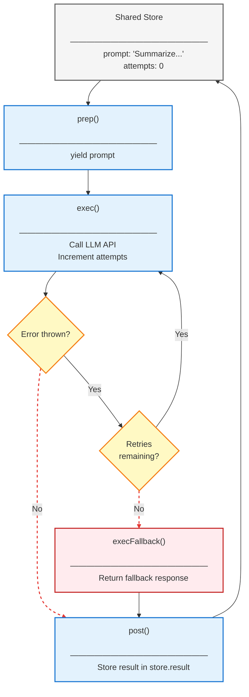

# Tutorial: Building a Resilient LLM Application with Retry and Fallback

> **[View example code](../../tests/retry-fallback.test.ts)**

## What Will Be Built

A resilient application that handles unreliable API calls will be created. When
the LLM API fails due to rate limits or network issues, automatic retries will
be attempted. If all retries are exhausted, a fallback response will be returned
to ensure the application continues to function gracefully.

Input:  "Summarize this article"
Behavior: API fails → Auto retry → API fails → Auto retry → Success
Output: "Summary of the article..."

## Execution Flow with Retry and Fallback



## Implementation

The resilient node will be implemented with automatic retry and fallback handling:

**Node Configuration**: The node will be configured with `maxRetries` and
`retryDelay` parameters. These settings control how many times the exec phase
will be retried and the delay between attempts.

**exec()**: The LLM API will be called in this phase. If the API throws an
error (rate limit, network failure, etc.), the error will be caught automatically
and the execution will be retried based on the configuration.

**execFallback()**: When all retry attempts are exhausted, this method will be
called automatically. A fallback response will be returned to ensure the
application continues to function gracefully.


## Example

```typescript
const store: RetryStore = {
  prompt: 'Summarize this article',
  attempts: 0
};

// Configure node with 3 retries and 10ms delay between retries
const node = new UnreliableNode({ maxRetries: 3, retryDelay: 10 });

// The `run()` function handles retries automatically
await run(node, store);

// Result will be either from successful exec or from execFallback
console.log(store.result);
console.log(store.attempts); // Shows how many attempts were made

 
```