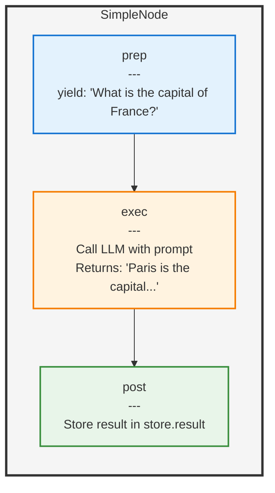

# Run a single turn question-answer task with a LLM

> **[View example code](../../tests/single-node.test.ts)**

## What Will Be Built

A simple application that asks a question and gets an answer from an LLM will be created. MicroFlow's three-phase execution pattern is used to structure the task.

## Understanding the Three Phases

Tasks are executed in three phases, similar to a production line:

1. **prep** - What needs to be processed is prepared (the prompt is yielded)
2. **exec** - The actual work is done (the LLM is called)
3. **post** - The results are handled (the answer is stored)

## Execution Flow



## Implementation


## Example

```typescript
const store: BasicStore = {
  prompt: 'What is the capital of France?'
};

const node = new SimpleNode();
// The `run()` function executes all three phases automatically,
// and the answer is stored in `store.result`.
await run(node, store);
// Contains the LLM response
console.log(store.result);

 
```