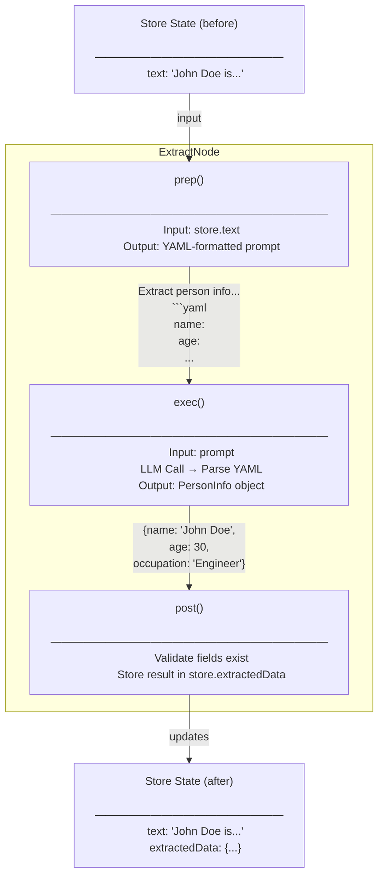

# Tutorial: Extracting Structured Person Information from Text

> **[View example code](../../tests/structured-output.test.ts)**

## What Will Be Built

A data extraction workflow that takes unstructured text about a person and
produces a validated, typed object containing their name, age, and occupation.
The LLM will be prompted to output YAML format, and the response will be validated
to ensure all required fields are present.

Input:  "John Doe is a 30 year old engineer working at a tech company."
Output: { name: "John Doe", age: 30, occupation: "Engineer" }

## Workflow Diagram



## Implementation

The workflow is divided into three phases:

**prep**: A prompt will be generated that instructs the LLM to extract person
information and format it as YAML. The prompt includes the input text and an
example of the expected output structure.

**exec**: The LLM will be called with the prompt. The response will be parsed
from YAML format into a strongly-typed PersonInfo object with name, age, and
occupation fields.

**post**: The extracted data will be validated to ensure all required fields
(name, age, occupation) are present. If any field is missing, an error will be
thrown. Otherwise, the data will be saved to the store.


## Example

```typescript
const store: StructuredStore = {
  text: 'John Doe is a 30 year old engineer working at a tech company.'
};

// Prompt is defined inside the ExtractNode class, check the implementation at tests/structured-output.test.ts
const node = new ExtractNode();
// The `run()` function executes all three phases automatically,
// validates the data, and stores it in `store.extractedData`.
await run(node, store);

// Access the extracted, validated data
console.log(store.extractedData);
// { name: 'John Doe', age: 30, occupation: 'Engineer' }

 
```