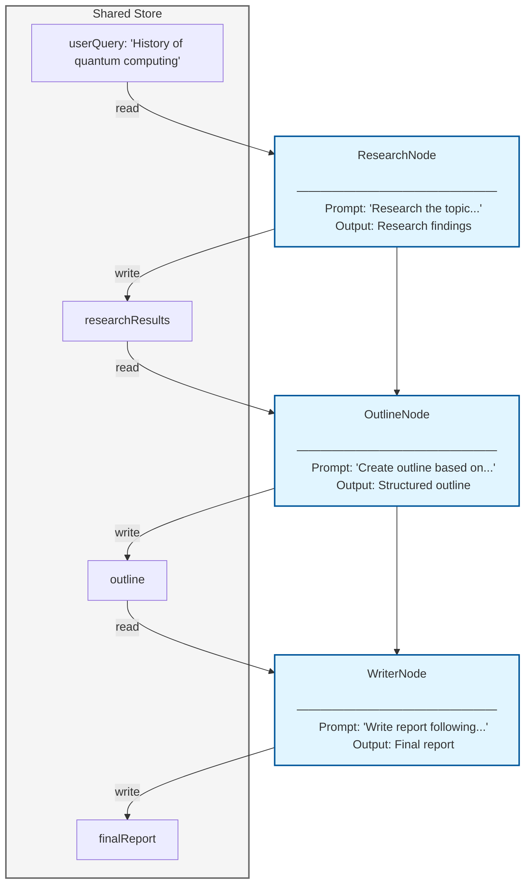

# Tutorial: Building a Sequential Research Report Workflow

> **[View example code](../../tests/workflow.test.ts)**

## What Will Be Built

A multi-step workflow will be created that generates a research report by chaining
three specialized nodes together. Each node performs a specific task: researching
the topic, creating an outline, and writing the final report. The nodes will be
connected sequentially, with each node building upon the work of the previous one
through a shared store.

Input:  "History of quantum computing"
Output: Research findings → Outline → Complete report

## Workflow Diagram



## Implementation

The workflow will be implemented with three nodes that execute sequentially:

**ResearchNode**: The initial query will be read from the store, and a prompt
will be generated asking the LLM to research the topic. The research findings
will be stored in `store.researchResults`, and the next node will be triggered
by returning a non-null action.

**OutlineNode**: The research results will be read from the store, and a prompt
will be generated asking the LLM to create an outline. The outline will be stored
in `store.outline`, and the next node will be triggered.

**WriterNode**: The outline will be read from the store, and a prompt will be
generated asking the LLM to write the final report. The completed report will be
stored in `store.finalReport`.

## Node Connections

**connect()**: Nodes will be connected using the `connect()` method. When a node
completes, the next node in the chain will automatically be executed. The shared
store allows each node to access the outputs from previous nodes.


## Example

```typescript
const store: WorkflowStore = {
  userQuery: 'History of quantum computing'
};

const researchNode = new ResearchNode();
const outlineNode = new OutlineNode();
const writerNode = new WriterNode();

// Connect nodes sequentially
researchNode.connect(outlineNode);
outlineNode.connect(writerNode);

// Execute the workflow starting from the first node
await run(researchNode, store);

// All results are available in the store
console.log(store.researchResults);  // Research findings
console.log(store.outline);          // Structured outline
console.log(store.finalReport);      // Complete report

 
```